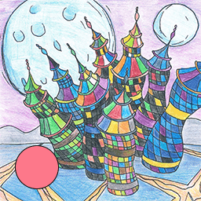
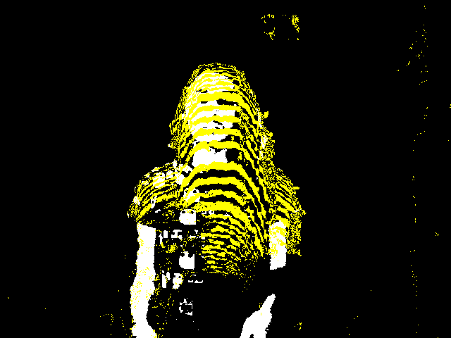

# engiffen [](https://ci.appveyor.com/project/tdaede/TooManyBees/engiffen)

Generates gifs from image sequences.





_Source frame, generated gif, and a gif from Photoshop_

# usage

## as binary

```bash
# Read a bunch of bitmaps and write them to a 20-frame-per-second gif at path `hello.gif`
engiffen *.bmp -f 20 -o hello.gif

# Read a range of files
engiffen -r file01.bmp file20.bmp -o hello.gif
# The app sorts them in lexicographical order, so if your shell orders `file9`
# before `file10`, the resulting gif will not be in that order.

# Use a faster but worse quality algorithm
engiffen -r file01.bmp file20.bmp -o hello.gif -q naive

# Use the default NeuQuant algorithm, but with a reduced pixel sample rate
# Values over 1 reduces the amount of pixels the algorithm trains with
engiffen -r file01.bmp file100.bmp -o hello.gif -s 2

# Print to stdout by leaving out the -o argument
engiffen *.bmp > output.gif
# or hose your console by forgetting to redirect!
engiffen *.bmp
```

(If your shell doesn't expand glob patterns into individual args (for
instance, the Windows commandline), the binary will parse a single
argument as a glob pattern and expand it into file names on its own.
You can install the binary with `--no-default-features` to skip this
feature.)

## as library

```rust
extern crate engiffen;

use engiffen::{load_images, engiffen, Gif, Quantizer};
use std::fs::File;

let paths = vec!["vector", "of", "file", "paths", "on", "disk"];
let images = load_images(&paths);
let mut output = File::create("output.gif")?;

// encode an animated gif at 10 frames per second
let gif = engiffen(&images, 10, Quantizer::Naive)?;
gif.write(&mut output);
```

```rust
// Optionally specify how many pixels of each frame should be sampled
// when computing the gif's palette. This value reduces the amount of
// sampling work to 1/9th of what it normally would, by only sampling
// every 3rd pixel on every 3rd row (i.e. pixels lying on a 3x3 grid).
let gif = engiffen(&images, 10, Quantizer::NeuQuant(3));
```

# debug output

To print timing info to STDERR, compile with the `debug-stderr` feature

```
$ cargo install engiffen --features debug-stderr

$ engiffen *.tif -f 15 -s 10 > out.gif
Checked image dimensions in 0 ms.
Pushed all frame pixels in 469 ms.
Computed palette in 67 ms.
Mapped pixels to palette in 3443 ms.
Wrote to stdout in 5415 ms
```

# misc

Tests that actually create gifs from sample frames are ignored. When
running the ignored specs, run in release mode or they'll take forever.

```
cargo test --release -- --ignored
```

## Major work to do

* Incremental frame processing

  Accept a stream of frames from a server to process individually as they arrive. Put off sorting the final palette and compiling the gif until finished.

## Contributing & Contact

Github doesn't like to alert me to notifications, so hit me up on Twitter [@toomanybees](https://twitter.com/toomanybees) for a quicker response.

PRs and Issues are always welcome.

## Anything else?


